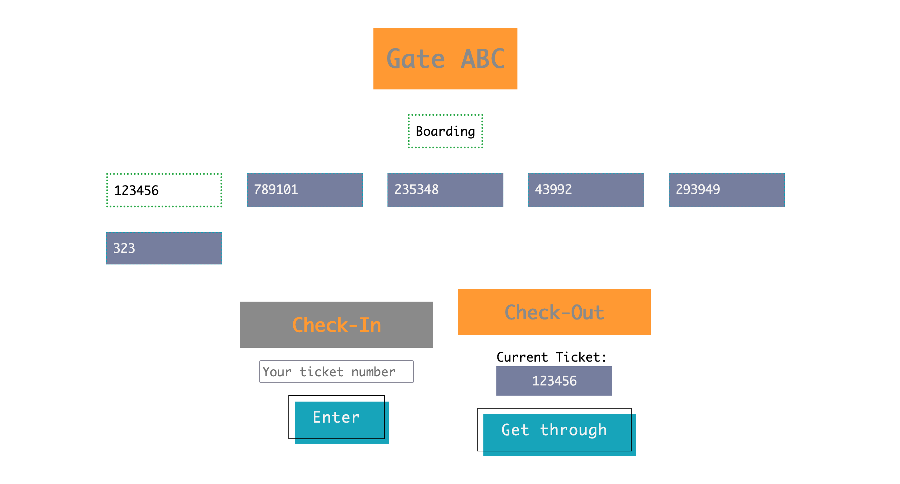

# TechMagic Academy - Basic Queue UI Solution

## Table of contents

- [Overview](#overview)
  - [The challenge](#project-requirements)
  - [Screenshot](#screenshot)
  - [How to start the project](#how-to-start-the-project)
- [My process](#my-process)
  - [Built with](#built-with)

## Overview

### Project Requirements

UI should include:

- Visual representation of a queue
- Input element
- Add button that adds value in input to the queue
- Remove button that removes oldest item
- Input and queue should be validated for emptiness and notify user about impossible actions (or prohibit to do them)

Additional requirements

- Input is cleared on addition
- State of the queue should be saved through page reloads
- Maximum items equals to Your age
- Logic should be separated into functions
- README should contain information on how to start a project

### Screenshot



### How to start the project

### Build

Create a dist folder

Run:

```
npm run build
```

Then open an index.html

### Open a live server

```
npm run start
```

## My process

### Built with

- Mobile-last Approach 😂
- [Sass](https://sass-lang.com/) - CSS preprocessor
- Flexbox
- CSS Grid
- [Webpack](https://webpack.js.org/) - Module bundler
- [Eslint](https://eslint.org/) - Linter (Airbnb Code Style)
- [Prettier](https://prettier.io/) - Code Formatter
- [NPM](https://www.npmjs.com/) - Package Manager
